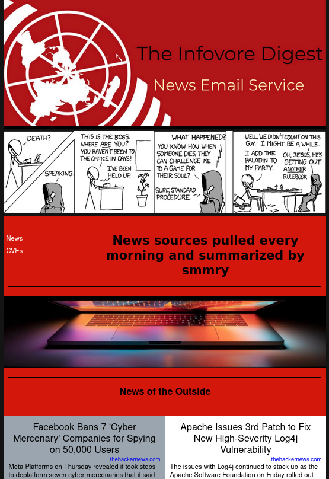
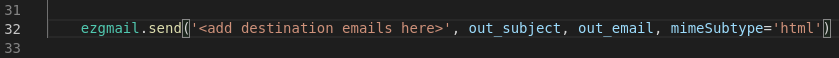

<div id="top"></div>
<!--
*** Thanks for checking out the Best-README-Template. If you have a suggestion
*** that would make this better, please fork the repo and create a pull request
*** or simply open an issue with the tag "enhancement".
*** Don't forget to give the project a star!
*** Thanks again! Now go create something AMAZING! :D
-->


<!-- PROJECT SHIELDS -->
<!--
*** I'm using markdown "reference style" links for readability.
*** Reference links are enclosed in brackets [ ] instead of parentheses ( ).
*** See the bottom of this document for the declaration of the reference variables
*** for contributors-url, forks-url, etc. This is an optional, concise syntax you may use.
*** https://www.markdownguide.org/basic-syntax/#reference-style-links
-->
[![Contributors][contributors-shield]][contributors-url]
[![Forks][forks-shield]][forks-url]
[![Stargazers][stars-shield]][stars-url]
[![Issues][issues-shield]][issues-url]
[![MIT License][license-shield]][license-url]
[![LinkedIn][linkedin-shield]][linkedin-url]


<!-- PROJECT LOGO -->
<br />
<div align="center">
  <a href="https://github.com/JochiRaider/Cybersecrity_News_Agent">
    
  </a>

<h3 align="center">Cybersecrity News Agent</h3>

  <p align="center">
    The project uses beautifulsoup to scrape a rotating list of security news websites for the latest articles, then uses the api from smmry.com to boil down the text to an adjustable number of sentences. Also, it grabs the newest CVEs added to the NIST NVD via their api. All of this is then composed into an HTML with inline CSS formatted email and can be sent to a list of recipients.
    <br />
    <a href="https://github.com/JochiRaider/Cybersecrity_News_Agent"><strong>Explore the docs »</strong></a>
    <br />
    <br />
    <a href="https://github.com/JochiRaider/Cybersecrity_News_Agent">View Demo</a>
    ·
    <a href="https://github.com/JochiRaider/Cybersecrity_News_Agent/issues">Report Bug</a>
    ·
    <a href="https://github.com/JochiRaider/Cybersecrity_News_Agent/issues">Request Feature</a>
  </p>
</div>


<!-- TABLE OF CONTENTS -->
<details>
  <summary>Table of Contents</summary>
  <ol>
    <li>
      <a href="#about-the-project">About The Project</a>
      <ul>
        <li><a href="#built-with">Built With</a></li>
      </ul>
    </li>
    <li>
      <a href="#getting-started">Getting Started</a>
      <ul>
        <li><a href="#prerequisites">Prerequisites</a></li>
        <li><a href="#installation">Installation</a></li>
      </ul>
    </li>
    <li><a href="#usage">Usage</a></li>
    <li><a href="#contributing">Contributing</a></li>
    <li><a href="#license">License</a></li>
    <li><a href="#contact">Contact</a></li>
    <li><a href="#acknowledgments">Acknowledgments</a></li>
  </ol>
</details>


<!-- ABOUT THE PROJECT -->
## About The Project




<p align="right">(<a href="#top">back to top</a>)</p>


### Built With

* [Python 3](https://www.python.org/)
* [EZgmail](https://ezgmail.readthedocs.io/en/latest/)
* [BeautifulSoup 4](https://beautiful-soup-4.readthedocs.io/en/latest/)

<p align="right">(<a href="#top">back to top</a>)</p>


<!-- GETTING STARTED -->
## Getting Started

To get a local copy up and running follow these simple example steps.

### Prerequisites

These are the non-standard libraries you need to use the software and how to install them.
* EZgmail
  ```sh
  pip install ezgmail
  ```
* BeautifulSoup 4
  ```sh
  pip install beautifulsoup4
  ```

### Installation

1. Set up a free [Google Cloud project](https://developers.google.com/workspace/guides/create-project)    
2. Clone the repo
   ```sh
   git clone https://github.com/JochiRaider/Cybersecrity_News_Agent.git
   ```      
3. Place google access credentials in the same folder as main.py [How to create access credentials](https://developers.google.com/workspace/guides/create-credentials)    
4. Add an email address to main.py at line 32   
    
5. Setup an account with summry and get an API key (see [link](https://smmry.com/api)). Add the API key to your enviromental variables as "SMMRY_API" 
6. Main.py can be run on the command line
   ```sh
   ./main.py
   ```
OR  

7. Setup in crontab, example cron job for everyday at 6 am 
   ```
   * 06 * * * /<your file path>/Cybersecrity_News_Agent/main.py
   ```

<p align="right">(<a href="#top">back to top</a>)</p>


<!-- USAGE EXAMPLES -->
## Usage

In-progress check back soon 

<p align="right">(<a href="#top">back to top</a>)</p>


<!-- CONTRIBUTING -->
## Contributing

Contributions are what make the open source community such an amazing place to learn, inspire, and create. Any contributions you make are **greatly appreciated**.

If you have a suggestion that would make this better, please fork the repo and create a pull request. You can also simply open an issue with the tag "enhancement".
Don't forget to give the project a star! Thanks again!

1. Fork the Project
2. Create your Feature Branch (`git checkout -b feature/AmazingFeature`)
3. Commit your Changes (`git commit -m 'Add some AmazingFeature'`)
4. Push to the Branch (`git push origin feature/AmazingFeature`)
5. Open a Pull Request

<p align="right">(<a href="#top">back to top</a>)</p>


<!-- LICENSE -->
## License

Distributed under the MIT License. See `LICENSE` for more information.

<p align="right">(<a href="#top">back to top</a>)</p>


<!-- CONTACT -->
## Contact

Aaron - jochikahn@gmail.com

Project Link: [https://github.com/JochiRaider/Cybersecrity_News_Agent](https://github.com/JochiRaider/Cybersecrity_News_Agent)

<p align="right">(<a href="#top">back to top</a>)</p>


<!-- ACKNOWLEDGMENTS -->
## Acknowledgments

* [Automate the Boring Stuff with Python](https://automatetheboringstuff.com/)
* [hackread.com](https://www.hackread.com/)
* [cyberdefensemagazine.com](https://www.cyberdefensemagazine.com/)
* [thehackernews.com](https://thehackernews.com/)
* [infosecurity-magazine.com](https://www.infosecurity-magazine.com/news/)
* [XKCD](https://xkcd.com/)
* [NIST NATIONAL VULNERABILITY DATABASE](https://nvd.nist.gov/)
* [Fullstack academy](https://www.fullstackacademy.com/)

<p align="right">(<a href="#top">back to top</a>)</p>


<!-- MARKDOWN LINKS & IMAGES -->
<!-- https://www.markdownguide.org/basic-syntax/#reference-style-links -->
[contributors-shield]: https://img.shields.io/github/contributors/JochiRaider/Cybersecrity_News_Agent.svg?style=for-the-badge
[contributors-url]: https://github.com/JochiRaider/Cybersecrity_News_Agent/graphs/contributors
[forks-shield]: https://img.shields.io/github/forks/JochiRaider/Cybersecrity_News_Agent.svg?style=for-the-badge
[forks-url]: https://github.com/JochiRaider/Cybersecrity_News_Agent/network/members
[stars-shield]: https://img.shields.io/github/stars/JochiRaider/Cybersecrity_News_Agent.svg?style=for-the-badge
[stars-url]: https://github.com/JochiRaider/Cybersecrity_News_Agent/stargazers
[issues-shield]: https://img.shields.io/github/issues/JochiRaider/Cybersecrity_News_Agent.svg?style=for-the-badge
[issues-url]: https://github.com/JochiRaider/Cybersecrity_News_Agent/issues
[license-shield]: https://img.shields.io/github/license/JochiRaider/Cybersecrity_News_Agent.svg?style=for-the-badge
[license-url]: https://github.com/JochiRaider/Cybersecrity_News_Agent/blob/master/LICENSE
[linkedin-shield]: https://img.shields.io/badge/-LinkedIn-black.svg?style=for-the-badge&logo=linkedin&colorB=555
[linkedin-url]: https://linkedin.com/in/aaron-kahn
[product-screenshot]: images/screen_cap.png
